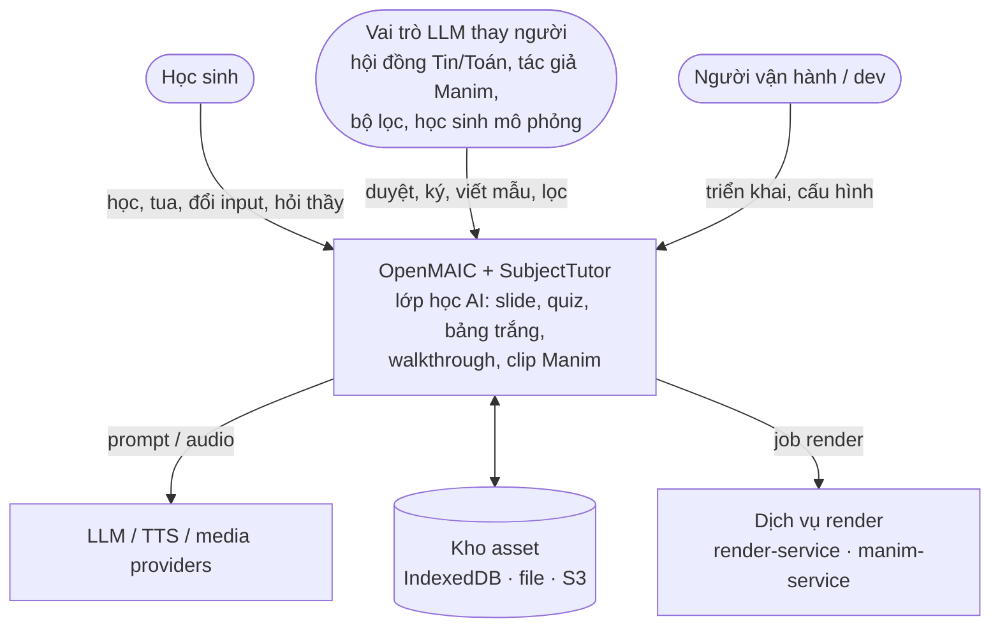
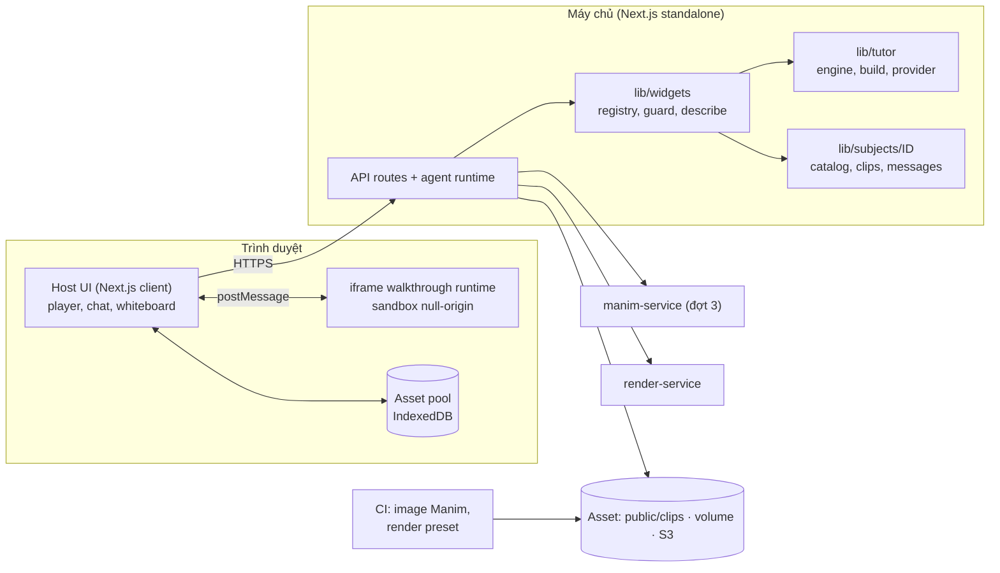
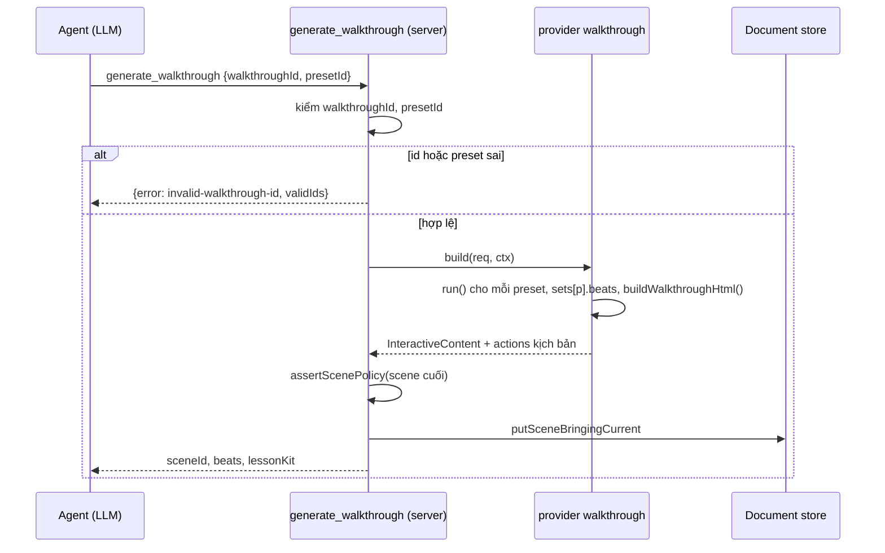
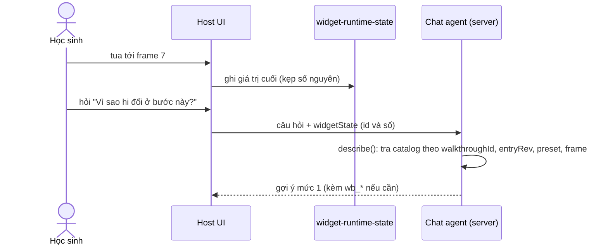
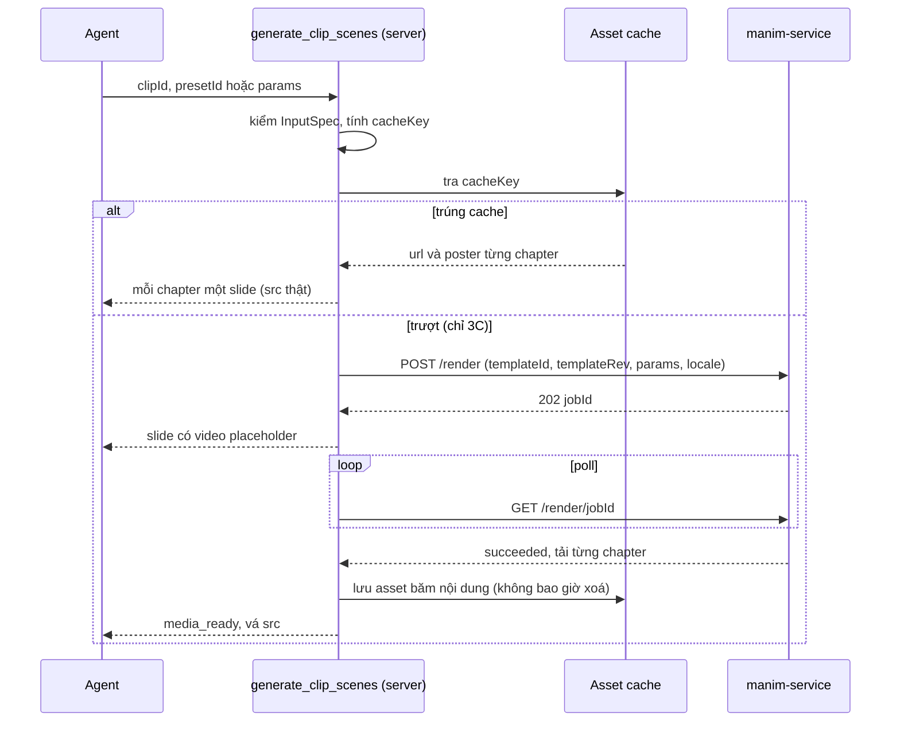

# OpenMAIC SubjectTutor — Architecture

- **Trạng thái**: Accepted — thiết kế, chưa có mã nguồn (sửa 2026-09-30 theo review: ADR 0010–0013)
- **Ngày**: 2026-09-30
- **Người sở hữu**: Chủ dự án (kiến trúc)
- **Liên quan**: [REQUIREMENTS](REQUIREMENTS.md), [INTERFACES](INTERFACES.md), [DATA-MODEL](DATA-MODEL.md), [SECURITY](SECURITY.md), [OPERATIONS](OPERATIONS.md), [NFR](NFR.md), [decisions/](decisions/README.md)

> **Tóm tắt:** SubjectTutor thêm Chuyên Tin và Chuyên Toán vào OpenMAIC bằng **widget HTML tự chứa** (walkthrough) và **clip Manim** (Toán).
> - **Chỉ có ở đường agent** (workbench): scene do **tool tất định** tạo (`generate_walkthrough`, `generate_clip_scenes`).
> - Provider ở **tầng app** nhận scene theo nội dung, trên vỏ `simulation`.
> - **Không đổi package, không thêm dependency.**
> - Chia module: `lib/widgets` (lõi mở rộng, chặn `code`), `lib/tutor` (engine + runtime), `lib/subjects/<id>` (nội dung từng môn), `manim/` (dựng clip).
> - §1b có sơ đồ C4; §4 có checklist mở rộng.

## 1. Tổng quan

SubjectTutor thêm hai môn (Chuyên Tin trước, Chuyên Toán sau) vào OpenMAIC — nền tảng đã có slides, quiz, whiteboard, thảo luận đa agent, TTS/ASR và widget tương tác (HTML trong iframe). Điểm mới:

- **Khung bài giảng cho bài khó** (ADR 0008): 12 giai đoạn, ánh xạ vào scene/widget/hành động sẵn có.
- **Walkthrough widget** (`kind:'walkthrough'`): trình chiếu từng bước — giải thích tiếng Việt, hình minh hoạ, bảng biến, panel phụ (heap/stack/queue), pseudocode, C++ và Python highlight theo bước (để đọc hiểu), **học sinh dự đoán và đổi input để quan sát** (preset; nhập tuỳ chỉnh trong giới hạn từ lát 1d), beats, thanh điều khiển.
- **Clip Manim cho Toán** (ADR 0007, hướng chính): video câm dựng từ **mẫu tham số hoá** (LLM chỉ chọn `clipId` + `presetId`/`params` đã kiểm). Mỗi chapter là một file và một slide do tool `generate_clip_scenes` tạo. Lời thầy TTS chạy riêng, trước và sau chapter (user xác nhận).
- **Thầy điều khiển và trả lời**: kịch bản tất định bằng `widget_setState/widget_highlight`, không bị giới hạn 3–8 action của LLM, đi theo beat của đúng preset (ADR 0013). Q&A biết học sinh đang ở frame nào và dạy kèm theo thang gợi ý (ADR 0009, 0008).
- **Học chủ động**: dự đoán bước kế (engine chờ có giới hạn), sắp dòng code, tìm dòng sai, điền bảng trace (ADR 0008 Decision 5).
- **Không có code editor cho học sinh** (ADR 0003): ứng dụng thuần giảng dạy; widget `code` **mặc định bị chặn** ở lúc hiển thị, ghi và sinh (ADR 0010). **Interactive và visualizer là mục đích chính**: walkthrough, simulation, diagram, game, 3D, đổi input để quan sát.
- **Hai luồng học sinh** `ts10` (thi vào 10 chuyên Tin) và `hsg`, có **bài giải đề**; code chỉ-đọc C++ và Python (ADR 0012).
- **Mở rộng bằng "gói môn học"** (ADR 0005): thêm môn dùng lại phương tiện có sẵn = thêm thư mục + một dòng đăng ký.

## 1b. Sơ đồ (C4)

**Mức 1 — Bối cảnh:**



**Mức 2 — Container:**



Chú giải: mũi tên nét liền là luồng chính; `postMessage` là kênh duy nhất giữa host và iframe ([INTERFACES §1–2](INTERFACES.md)); `manim-service` chỉ nhận `templateId` + `params` số/enum ([SECURITY](SECURITY.md)); ranh giới tin cậy chi tiết ở [SECURITY §2](SECURITY.md).

## 2. Luồng end-to-end

Chỉ đường **agent** (workbench bật: `OPENMAIC_AGENT_RUNTIME_ENABLED` + `DATABASE_URL` + `NEXT_PUBLIC_PRO_WORKBENCH_ENABLED`, ADR 0011). Đường classic không tạo walkthrough; nó chỉ chịu chặn `code` (ADR 0010).

```
user → agent đọc SKILL.md (blueprint, bảng walkthroughId, "khi học sinh hỏi")
  │   slide/quiz: generate_scene như cũ (schema không có `code` khi bị chặn)
  ▼   trace số liệu: generate_walkthrough{walkthroughId, presetId?, panel?}
tool (server, KHÔNG gọi LLM)
  1. kiểm id/preset (lỗi kèm validIds)             ADR 0006, INTERFACES §3
  2. provider.build(): run() cho MỖI preset → Frame[] + sets[p].beats
     buildWalkthroughHtml() → HTML tự chứa (2 khối JSON + runtime inline + CSP)
     actions(): theo beats của presetId: [ask/predict] → setState{preset,frame} → speech
  3. assertScenePolicy(scene cuối) → putSceneBringingCurrent   ADR 0010, 0013
  4. trả {sceneId, beats, lessonKit} → agent soạn slide quanh walkthrough
  ▼
scene = InteractiveContent{ html, widgetType:'simulation',
                            widgetConfig:{kind:'walkthrough', walkthroughId, entryRev, presetId, …} }
  ▼ playback: InteractiveRenderer (chặn `code`) → iframe → widget-ready
              host gửi lại desired SET_WIDGET_STATE → runtime nhảy frame
  ▼ Q&A: widget-state → store → describe(scene, {preset, frame}) tra CATALOG → thầy thấy frame k
        tin nhắn học sinh và câu trả lời của thầy đi qua bộ lọc tutor-moderation (ADR 0014)
        beat, dự đoán, gợi ý → tutorLearning (kho runtime, Postgres)
```

## 2b. Sơ đồ trình tự các luồng chính

**Tạo scene walkthrough (đường agent):**



**Phát bài: bắt tay và gửi lại trạng thái (ADR 0013):**

```mermaid
sequenceDiagram
  participant E as ActionEngine
  participant H as Host (InteractiveIframeHost)
  participant F as iframe runtime
  E->>H: SET_WIDGET_STATE (preset, frame 5)
  H->>H: desired = lệnh cuối; iframe chưa ready nên giữ lại
  F->>H: widget-ready (walkthroughId, entryRev, presets)
  H->>F: gửi lại desired
  F->>H: widget-state (preset, frame 5)
  Note over H,F: iframe bị đẩy khỏi pool rồi dựng lại thì ready lần nữa và host gửi lại desired
```

**Q&A theo frame:**



**Tạo slide clip Manim (3A dựng sẵn; 3C theo yêu cầu):**



## 3. Đã cắt hoặc đổi so với các bản trước

| Trước | Bây giờ | Lý do |
| --- | --- | --- |
| Registry `SubjectTutor` (`registerSubjectTutor…`) | Registry **`WidgetProvider` + `SubjectPack`** ở `lib/widgets`, `lib/subjects` | ADR 0005: registry cũ không có consumer; registry mới có hook thật (`build/actions/describe`). |
| Hàm bọc `generateSceneContent` + `widgetOutline.walkthroughId` + `SceneEnricher` | Tool tất định `generate_walkthrough`, `generate_clip_scenes`; chỉ đường agent | ADR 0011 (review 2026-09-30: A1, A4, A5). |
| Cờ `OPENMAIC_BLOCK_CODE_WIDGET` (mặc định mở), guard ở điểm sinh | `OPENMAIC_ALLOW_CODE_WIDGET` (mặc định chặn); chặn lúc hiển thị + ghi + sinh + CSP | ADR 0010 (review: F1, F2, A6). |
| Beat cho cả entry, `beatFrames[id]` | `beatDefs` + `sets[p].beats` theo từng preset; `widget-ready`; `entryRev` | ADR 0013 (review: B1, B2, M2, M3). |
| `WalkthroughWidget` React, `usePlayer` | Runtime thuần trong iframe; `createPlayer` | ADR 0005: iframe srcDoc sandbox không với tới bundle host. |
| Protocol `WALKTHROUGH_*` | `SET_WIDGET_STATE`, `HIGHLIGHT_ELEMENT` (host→iframe) + `widget-state` (iframe→host) | Tái dùng kênh có sẵn (`components/scene-renderers/InteractiveIframeHost.tsx:205-225`; `lib/action/engine.ts:872-902`). |
| Template LLM `algorithm-walkthrough`, `proof-walkthrough`, `problem-walkthrough` | Bỏ | ADR 0006: dữ kiện do hàm thuần sinh. |
| Nhiều `widgetType` | Vỏ `simulation` + `widgetConfig.kind` | `WidgetType` là union đóng; không đổi package. |
| Visualizer `arrayBars`, `dpTable`, `callStack`, `hashTable`, `linkedList`, `segmentTree` riêng, `numberLine`, `vector` | `array`, `tree`, `graph`, `grid`, `geometry`, `functionPlotter`, `proofOutline` + panel phụ | Đếm curriculum: `callStack`/`linkedList` 0 topic; segment tree là cây; `dpTable` tổng quát thành `grid`; `numberLine` chỉ phục vụ một mẫu. |
| D3/`@xyflow/react`/`motion`/`shiki` | SVG/DOM tự viết | ADR 0002 (SWOT + khảo sát). |
| Desmos/GeoGebra; manim-web; LLM viết mã Manim chạy trên server | Bỏ | ADR 0007. |
| Manim = pilot 1–3 clip có cổng | **Manim là hướng chính cho Toán**: mẫu tham số hoá (M3) trên nền thư viện dựng sẵn (M1), phân bổ Z (Manim / walkthrough SVG / slide) | ADR 0007 (user xác nhận 2026-09-30). |
| `outline-constraints.json` làm cơ chế cưỡng chế | Chỉ cảnh báo; chặn widget `code` bằng cờ + guard | ADR 0010; `lib/server/agent-runtime/skills.ts:719,879-890`. |
| Cảnh 6 "code" (luyện code) trong curriculum | Bỏ; thay bằng quiz tự luận AI chấm. **"Đổi tham số" được giữ** (preset + nhập input) | ADR 0003, 0008. (Bản 2026-09-29 hiểu nhầm là phải bỏ cả "đổi tham số" và widget LLM sinh.) |

## 4. Kiến trúc mở rộng

```
lib/widgets/            # lõi mở rộng (làm một lần)
  types.ts  registry.ts  policy.ts (isCodeWidget, assertScenePolicy)  describe.ts
lib/server/agent-runtime/walkthrough-tools.ts   # tool generate_walkthrough (ADR 0011); Phase 3: clip-tools.ts
lib/tutor/              # engine walkthrough dùng chung mọi môn
  engine/  protocol/  runtime/  build/  provider.ts  input-spec.ts
lib/clips/              # lõi clip Manim: types, cache-key, provider clip, adopt (ADR 0007)
lib/subjects/
  index.ts              # danh sách gói khai báo tường minh
  cp/    pack.ts  catalog/*.ts  messages/{vi-VN,en-US}.ts
  math/  (Phase 3)
skills/agent-runtime/<skill>/{SKILL.md, references/…}
tests/widgets  tests/tutor  tests/subjects/<id>
```

Contract (`WidgetProvider`, `SubjectPack`) ở ADR 0005; `WalkthroughEntry` ở ADR 0006; `ClipEntry` ở §8b. Nguồn chính thức của giao diện: [INTERFACES §5](INTERFACES.md).

**Checklist mở rộng** (mọi mục đều là *thêm file*, ngoại trừ dòng đăng ký; mục cuối là ngoại lệ):

| Muốn thêm | Làm |
| --- | --- |
| Một bài (walkthrough, kể cả bài giải đề) | 1 file entry trong `lib/subjects/<id>/catalog/` (`beatDefs`, preset, C++ + Python + hai `map`, `entryRev`) + thêm vào `pack.ts` + test + sinh lại khối id trong `SKILL.md` và union id của tool. |
| Một visualizer | 1 module `VisualizerRenderer` + 1 entry build + quy ước key `highlights/pointers` + 1 test trình duyệt. |
| Một môn mới **dùng phương tiện có sẵn** (Toán, …) | `lib/subjects/<id>/` + 1 dòng trong `lib/subjects/index.ts` + 1 skill (`title` có chữ Hán + `skill.title.<handle>` ở 12 locale) + `references/` (curriculum). Engine/runtime/provider/Q&A/policy không đổi. Toán **lần đầu** dùng clip thì phải làm hạ tầng clip một lần (`lib/clips`, tool `generate_clip_scenes`, `manim/`) ở Phase 3A — đó là thêm phương tiện, không phải thêm môn. |
| Một mẫu clip Manim | 1 file `lib/subjects/math/clips/<id>.ts` (`ClipEntry`) + 1 file `manim/templates/<id>.py` + preset + `invariants` + test + sinh lại khối id trong `SKILL.md` + render CI. |
| Một **loại phương tiện** mới | **Ngoại lệ, không chỉ thêm file**: ADR mới + 1 `WidgetProvider` + 1 tool tạo scene + 1 trường trong `SubjectPack` (ADR 0005). |

## 5. Step engine (`lib/tutor/engine/`)

Đặc tả: ADR 0001. `Frame = {state, meta}`; `meta` gồm `explanation`, `codeLine` (pseudocode), `highlights`, `pointers`, `vars` (bảng biến), `aux` (heap/stack/queue…), `tags` (`beat:<id>`). Snapshot đầy đủ, `structuredClone` + freeze, `RangeError` khi vượt trần.

Quy tắc entry: thuần và deterministic; `state` chỉ là dữ liệu; đánh dấu bằng `meta`; mỗi frame có `codeLine` và `explanation` (gợi mở, không phải định nghĩa) theo `locale`; frame mốc gắn `beat:<id>`; test đối chiếu kết quả cuối với cách tính độc lập.

## 6. Runtime và shell (`lib/tutor/runtime/`, `lib/tutor/build/`)

> Dữ liệu trong HTML: [DATA-MODEL §3](DATA-MODEL.md).

Widget = một HTML tự chứa:

```
<div id="wt-root" data-frame-index data-total-frames data-playing data-preset>
  #wt-title
  #wt-explanation (aria-live)          #wt-beats (nút mốc, `data-beat`)
  #wt-visualizer                        #wt-vars (bảng biến)   #wt-aux (panel phụ)
  #wt-code  (tab: #wt-tab-pseudo | #wt-tab-cpp | #wt-tab-py; mỗi dòng có `data-line`, KHÔNG id từng dòng)
  #wt-predict (câu hỏi dự đoán, 1c)   #wt-exercise (sắp dòng / tìm dòng sai)
  #wt-caption
  #wt-controls: #wt-prev #wt-play #wt-next #wt-reset #wt-speed #wt-frame-slider #wt-frame-counter #wt-preset  #wt-input #wt-apply #wt-input-error (chỉ khi entry bật `customInput`)
<script type="application/json" id="widget-config">     # nhẹ (đi vào widgetConfig + prompt)
<script type="application/json" id="walkthrough-data">  # đầy đủ: sets[preset] = {frames, beats}, code{pseudo, impl{cpp,py}, map{cpp,py}}, labels
<script> runtime IIFE (core + đúng 1 visualizer) </script>
```

- **Mọi id tương tác nằm trong DOM tĩnh** do builder sinh (Element Inventory bỏ `<script>/<style>`, `MAX_IDS=60`, `packages/@openmaic/generation/src/scene-generator.ts:1352`). ~20 id cố định.
- `widget-config` nhẹ: **đủ các trường bắt buộc ở ADR 0013 §5** (hình dạng và ví dụ ở [DATA-MODEL §3](DATA-MODEL.md)); `beats` là của `presetId`. Không object có `type ∈ {text,shape,table,latex}`, không key `teacherActions` (`sanitize-scene-content.ts:251-274`).
- **CSP** do builder **nhúng sẵn** vào HTML walkthrough (`lib/tutor/build/csp.ts`; `patchHtmlForIframe` chỉ chèn CSP cho widget LLM, sau spike Q10): `default-src 'none'; script-src 'unsafe-inline'; style-src 'unsafe-inline'; img-src data: blob:; font-src data:; connect-src 'none'; form-action 'none'` (ADR 0010 L5). Công thức KaTeX dựng sẵn trên server; iframe chỉ có CSS + font inline.
- Runtime gửi `widget-ready` khi khởi tạo xong; tự đặt `presetId` + frame 0 nếu chưa nhận lệnh (ADR 0013 §2).
- Nội dung động chỉ chèn bằng `textContent`/`setAttribute`; công thức KaTeX (delimiter `\( \)`) chỉ ở chuỗi do tác giả catalog viết. `input` (từ 1d) đi qua `parseInput` (`record` strict, khoá lạ bị từ chối); chuỗi chỉ đến từ `enum` hoặc `string` có `alphabet` cố định, không nhãn tự do.
- Không dùng `localStorage`/URL (iframe null-origin); trạng thái nằm trong bộ nhớ và `data-*` của `#wt-root`.
- Số frame hiển thị 1-based (`3 / 12`) để khớp lời thầy "bước 5"; `state.frame` trong message là 0-based.
- Chuyển động: CSS transition; `render(frame, prev)` cho visualizer nhận frame trước.

Player (`createPlayer`): `getState/subscribe/play/pause/toggle/step/jump/setSpeed/reset/dispose`; tiêm `setTimer/clearTimer` để test bằng fake timer; tự pause ở frame cuối; **nút** Phát ở frame cuối quay về 0, còn message `playing:true` thì idempotent (chỉ về 0 khi `restart:true`, INTERFACES §1); `speed ∈ [0.25, 2]`.

## 7. Giao thức

> Hợp đồng đầy đủ và phiên bản (nguồn chính thức): [INTERFACES](INTERFACES.md).

**Host → iframe** (tái dùng; host gửi `{type, ...payload}` bằng `postMessage(…,'*')`):

| Action | Message | Runtime xử lý |
| --- | --- | --- |
| `widget_setState` | `SET_WIDGET_STATE {state:{preset?,frame?,panel?,speed?,playing?,restart?,predict?}, content?}` | Áp theo thứ tự `preset → frame → panel → speed → playing`; `preset` lạ → bỏ cả message; `frame` kẹp theo bộ mới; `panel: 'pseudo'|'cpp'|'py'`; `predict` hiện câu hỏi dự đoán; `content` hiện ở `#wt-caption`. |
| `widget_highlight` | `HIGHLIGHT_ELEMENT {target, content?}` | `querySelector` (try/catch), class `wt-flash` ~1,5 s. |
| `widget_annotation`, `widget_reveal` | `ANNOTATE_ELEMENT`, `REVEAL_ELEMENT` | Bỏ qua (kịch bản không dùng). |

**Iframe → host** (kênh có sẵn `__maicInteractive`):
- `widget-ready {v, walkthroughId, entryRev, presets[{id,total}]}` một lần khi khởi tạo.
- Sau đó `widget-state {v, walkthroughId, preset, frame, input?, prediction?}` mỗi lần đổi frame/preset/trả lời dự đoán. `input` chỉ có với preset `student` (1d), đã qua `inputSpec`, ≤ 2048 byte.

Host chỉ nhận `widget-state` sau `ready`. Host kẹp lại, lưu store, và giữ `desired` để gửi lại (ADR 0013). Runtime kiểm `event.source === window.parent`; guard viết tay; giá trị ngoài miền bị bỏ hoặc kẹp; không ném lỗi. Hợp đồng đầy đủ: [INTERFACES §1–2](INTERFACES.md).

## 8. Visualizer

`VisualizerRenderer { type, mount(container, config), render(frame, prev?), destroy?() }`; mỗi visualizer là module DOM/SVG + một entry build riêng (widget chỉ nhúng core + đúng visualizer cần). Key của `highlights/pointers` do visualizer định nghĩa:

| `type` | Giai đoạn | `state` | key `highlights` | Ghi chú |
| --- | --- | --- | --- | --- |
| `array` | 1 | `{ values, mode: 'bars'|'cells'|'bits', rows? }` | chỉ số | 2 hàng cho KMP/big-int; chế độ bit cho mask |
| `tree` | 2A | `{ nodes:{id,label,parent?}[] }` (rừng) | id node | cây gọi đệ quy, DSU, segment tree, DP cây |
| `graph` | 2A | `{ nodes:{id,x,y}[], edges:{from,to,weight?,directed?,kind?}[] }` | id node / `"A-B"` | toạ độ từ entry hoặc vòng tròn; panel phụ cho heap/stack/queue |
| `grid` | 2A | `{ rows, cols, cells }` | `"r,c"` | DP lưới (thay `dpTable`), bàn cờ, sàng |
| `geometry` | 3B | `{ points, segments, circles?, angles? }` | id đối tượng | dùng chung Tin (`t4-geometry`) và Toán |
| `functionPlotter` | 3B | `{ curves:{id,points}[], marks?, bounds }` | id | mẫu tính ở server từ hệ số đa thức; không parser/`eval` |
| `proofOutline` | 3B | `{ nodes: ProofNode[] }` | id node | cây logic + KaTeX |

Panel phụ dùng chung: `vars` (bảng biến) và `aux` (danh sách có nhãn) — hiển thị heap của Dijkstra, stack của Tarjan, queue của BFS, mảng failure của KMP.

## 8b. Clip Manim (Toán, ADR 0007)

```ts
interface ClipEntry<I = unknown> {           // lib/subjects/math/clips/<id>.ts (dùng chung InputSpec, Messages, presets, beats với WalkthroughEntry)
  readonly id: string                        // duy nhất trên mọi gói; provider clip nhận slide theo name 'clip:<id>@…'
  readonly kind: 'prebuilt' | 'template'     // M1 | M3
  readonly curriculumTopics: readonly string[]
  readonly title: Messages
  readonly inputSpec: InputSpec              // params chỉ là số/enum — KHÔNG chuỗi tự do (không đường tiêm LaTeX)
  readonly check?: (input: I) => readonly string[]   // ràng buộc giữa các tham số (tam giác không suy biến, a > b…), như WalkthroughEntry.check
  readonly presets: readonly { id: string; label: Messages; input: I }[]     // 3–5
  readonly engine: { name: 'manim-ce'; version: string; templateRev: number }
  readonly render: { w: 1280; h: 720; fps: 30 }
  readonly silent: true                      // lời thầy = TTS; chữ trên màn tối thiểu
  readonly chapters: readonly { id: string; startSec: number; endSec: number; label: Messages; before: Messages; after: Messages; caption?: Messages; ask?: Messages }[]   // lời thầy trước/sau chapter (clip câm)
  invariants(input: I): boolean              // hàm thuần TS: bất biến toán, chạy trên mọi preset và biên
  readonly bakedText: boolean                // có chữ nướng theo locale? false → locale = null trong cache key
  cacheKeyInput(input: I, locale: Locale): unknown[]   // phần do app tính của cache key; định nghĩa đầy đủ ở DATA-MODEL §4 (templateId = id)
  asset(input: I, locale: Locale): { master?: string; chapters: { id: string; url: string; poster: string }[] } | null   // null = chưa dựng
  readonly sheet: { readonly chapters: readonly { id: string; shows: Messages; formulas: readonly string[]; misconceptions: readonly Messages[]; hints: readonly [Messages, Messages, Messages] }[] }   // nguồn của clip-sheet.json; Q&A tra trực tiếp từ đây (thêm 2026-10-01)
}
// Module của mỗi clip export thêm hàm thuần expectedDisplay(input): Record<string, number> — số/toạ độ mà cảnh phải ghi vào manifest.json; CI đối chiếu (thêm 2026-10-01)
```

- **Đường đi** (ADR 0011): tool `generate_clip_scenes{clipId, presetId}` tạo **mỗi chapter một slide**. Mỗi slide có tiêu đề, một `PPTVideoElement` (`name:'clip:<id>@<hash>#<chapterId>'`, `src` URL cụ thể) và text chú thích. Kịch bản tất định là `speech(before) → play_video → speech(after)`. Clip được adopt vào asset pool khi dùng lần đầu (export/import/MP4).
- **Dựng**: `manim/` (Python, image pin Manim CE 0.21.0 + TeX Live + font OFL) qua CI (`scripts/render-clips.mjs`) → asset băm tên (≤10 clip trong `public/clips/`, còn lại volume/S3). Đợt 3C: `manim-service` là container thứ hai theo hợp đồng `render-service`: dài hạn, đã cứng hoá, mỗi job một tiến trình con có giới hạn, mạng riêng, có token (ADR 0007 Decision 5). `generate_clip_scenes{params}` nhận thêm nhánh bất đồng bộ như `generate_video` (placeholder, `media_ready`).
- **Cổng chất lượng** trước khi vào thư viện: `ffprobe`, bbox chữ, SSIM khung vàng, `invariants` + manifest đối chiếu độc lập, hội đồng LLM Toán ký (Phase 3 §6.1, ADR 0014).

## 9. Skills và curriculum

- Mỗi môn một skill: `SKILL.md` (kênh chỉ dẫn LLM về cách dạy: blueprint ADR 0008, quy tắc "khi học sinh hỏi", khối bảng `walkthroughId` **sinh từ catalog**; id hợp lệ cũng nằm trong schema của tool `generate_walkthrough`) + `references/` (curriculum theo tier). `outline-constraints.json` chỉ giữ trường có nghĩa: `allowedTypes`, `firstSceneType`, `sceneCount` — **chỉ cảnh báo** (`lib/server/agent-runtime/skills.ts:879-890`), không phải cưỡng chế.
- **Curriculum là dữ liệu trong `references/` của skill** (công cụ `read` của agent chỉ đọc trong thư mục skill có `SKILL.md`, `lib/server/agent-runtime/skills.ts:596-604`); thư mục không có `SKILL.md` làm test `tests/agent-runtime/skills.test.ts:241-252` đỏ. File ~79 KB nên chia theo tier + một `index.json` (id, tên, tier, prerequisites, độ khó) để agent không đọc nguyên khối. Tạm thời ở `docs/tutor/curriculum/`.
- Khi user hỏi "cả chuyên đề X": chọn topic theo chuỗi `prerequisites` (không chỉ theo tier; DP = 1 topic tier 3 + 4 topic tier 4), làm theo skill `curriculum-planner`.

## 10. i18n

- Nhãn điều khiển: `subject.tutor.*` trong **cả 12** `lib/i18n/locales/*.json` (`pnpm check:i18n-keys` so mọi locale với `en-US`; nó không bắt được thiếu key ở `en-US` — thêm `tests/i18n/tutor-locales.test.ts`). Provider bake nhãn vào `walkthrough-data.labels`.
- Tên skill: `skill.title.<handle>` (khoá `workbench.skill.title.<handle>`) trong `workbenchEn`, `workbenchZh` (`lib/i18n/workbench.ts`) và 10 overlay `workbench-locales/*.json`; `title` frontmatter phải chứa chữ Hán (`tests/agent-runtime/skills.test.ts:255-268`).
- Nội dung catalog (`explanation`, `narration`, `label`) do bảng `Messages` theo locale: `vi-VN`, `en-US`; locale khác dùng `en-US`.

## 11. Kiểm thử

> Chiến lược đầy đủ, lệnh và cổng CI: [TEST-STRATEGY](TEST-STRATEGY.md).

- Vitest chỉ thu thập `tests/**/*.test.ts` (`vitest.config.ts:11`) → test ở `tests/widgets`, `tests/tutor`, `tests/subjects/<id>`, môi trường node.
- Node: engine, player (fake timer), guard message, từng entry (biên, determinism, không mutate input, JSON round-trip, trần frame/byte, kết quả cuối đối chiếu độc lập, `code.map` toàn phần), catalog↔SKILL.md (snapshot), `buildWalkthroughHtml` (2 khối JSON parse được; `extractInteractiveElements` liệt kê `#wt-*` và ≤60 id; HTML không chứa `katex`/`</script`/`<!--` ngoài dự kiến), policy chặn `code` (cả hai trường; mọi tool agent; classic và `scene-content` coerce; render không mount iframe; kiểm kê đường ghi; mở cờ thì không chặn; widget khác không bị chặn), khoá `patch_stage` với walkthrough, beat theo preset, snapshot `entryRev`/`framesHash`, `describe` (chữ từ catalog), tương đương `steps` server/iframe khi `customInput`, curriculum (id duy nhất, prerequisite tồn tại, không vòng, không phụ thuộc ngược tier, `sequencing` đủ 32 topic).
- Trình duyệt: Playwright (`e2e/tests`, cần chromium + dev server cổng 3002, `playwright.config.ts`). Test nạp HTML vào iframe `srcdoc` với đúng `sandbox`, rồi kiểm:
  - `widget-ready`;
  - `SET_WIDGET_STATE` gửi trước khi ready vẫn được áp;
  - `data-frame-index`, message `widget-state`;
  - 0 request ra ngoài (CSP).
- Eval (ADR 0006, 0008): `eval:walkthrough-actions`, `eval:tutor-lesson`, `eval:tutor-qa`.

## 12. Export và video (giới hạn đã biết)

- Widget tự chứa đi qua export HTML/PPTX/ZIP như widget khác (`lib/export/inline-assets.ts`).
- **Export MP4 đóng băng widget sau ~250 ms**, trong trang có CSP chặn script ngoài và mọi request; beat `widget_*` chỉ là marker chưa dựng (`lib/video-export-app/prepare-interactive-html.ts:36-153`, `passes/timeline.ts:257-266`). [Inference] Walkthrough trong MP4 là một khung tĩnh và lời "bước 5" lệch hình.
- Giảm thiểu (backlog, chọn khi có nhu cầu MP4): (i) runtime nhận diện cờ chụp tĩnh và nhảy tới `posterBeat` (chưa kiểm khả thi); (ii) dựng thêm slide ảnh cho từng beat; (iii) mở rộng video-export để phát lại `widget_setState` (đổi lõi); (iv) render bằng Hyperframes (ADR 0007). Clip Manim (ADR 0007) đi qua đường video của slide (`VideoSegment`) nên **không** bị giới hạn này **nếu clip là blob trong asset pool** (adopt khi dùng lần đầu); clip chỉ là URL server [Inference] có nguy cơ bị bỏ khỏi ZIP và bị cap 5 phút trong MP4 — spike S3 (Phase 3 §8).

## 13. Bảo mật

> Mô hình đe doạ đầy đủ: [SECURITY](SECURITY.md).

- `run()` chạy trên server khi tool dựng scene (và trong iframe ở lát 1d) → `inputSpec` (strict), JSON thô ≤ 2048 byte, `maxFrames`/`maxSteps` (`tick`)/`maxBytes` theo entry (ADR 0001, 0006).
- Message: kiểm `event.source`, guard kiểu, kẹp miền; iframe→host chỉ id và số nguyên đã kẹp. Ngữ cảnh chat lấy **chữ từ catalog** phía server; không lấy từ iframe, HTML hay `widgetConfig` của scene (chống prompt-injection, ADR 0013 §8).
- DOM: `textContent`; không `eval`; đồ thị hàm số dùng hệ số đa thức.
- Không có trình soạn/chạy code của học sinh: widget `code` mặc định bị chặn ở hiển thị, ghi, sinh (ADR 0010). CSP walkthrough không cho mạng, không `eval`. `run()` chạy trong iframe sandbox với input đã kiểm và có trần.
- Manim (ADR 0007): chỉ mã mẫu của ta chạy; `params` là số/enum (không chuỗi tự do → không tiêm LaTeX; Manim gọi `latex` không có `-no-shell-escape`); render trong container dài hạn đã cứng hoá, mỗi job một tiến trình con có giới hạn và bị kill cả process group, mạng riêng, token (ADR 0007 Decision 5); **LLM không bao giờ viết mã Manim chạy trên đường phục vụ**; không sao chép mô hình cách ly của `render-service` (root + `CAP_NET_ADMIN`) cho mã Python.

## 14. Tech stack

> Triển khai, cấu hình, CI, giám sát: [OPERATIONS](OPERATIONS.md).

Không thêm npm dependency (ADR 0002). Dùng: SVG/DOM, validator `InputSpec` tự viết (~60 dòng, không dependency), KaTeX (dựng sẵn trên server, CSS + font inline, theo tiền lệ `katex-assets.ts`), Rollup + `rollup-plugin-typescript2` (root đã có; công cụ cuối cùng chốt ở spike Q1), Playwright (đã có). Manim CE 0.21.0 (pin) + TeX Live + font OFL trong image riêng (`manim/`), dựng bằng CI — **không** phải dependency của app; dịch vụ `manim-service` (đợt 3) là container thứ hai theo hợp đồng `render-service`.

## 15. Liên kết

| Loại | Tài liệu |
| --- | --- |
| Tổng quan, yêu cầu | [README](README.md), [REQUIREMENTS](REQUIREMENTS.md), [GLOSSARY](GLOSSARY.md), [ONBOARDING](ONBOARDING.md) |
| Chất lượng, rủi ro | [NFR](NFR.md), [RISKS](RISKS.md) |
| Thiết kế kỹ thuật | [DATA-MODEL](DATA-MODEL.md), [INTERFACES](INTERFACES.md), [SECURITY](SECURITY.md), [OPERATIONS](OPERATIONS.md), [TEST-STRATEGY](TEST-STRATEGY.md) |
| Nội dung dạy | [CONTENT-DESIGN](CONTENT-DESIGN.md), `curriculum/` |
| Quyết định | [decisions/README](decisions/README.md) (ADR 0001–0013) |
| Đặc tả theo đợt | [Phase 1](phase-1-base-layer/SCHEMA.md), [Phase 2](phase-2-competitive-programming/SCHEMA.md), [Phase 3](phase-3-olympiad-math/SCHEMA.md) |
| Lịch sử | [REVIEW-2026-09-29](REVIEW-2026-09-29.md) |
