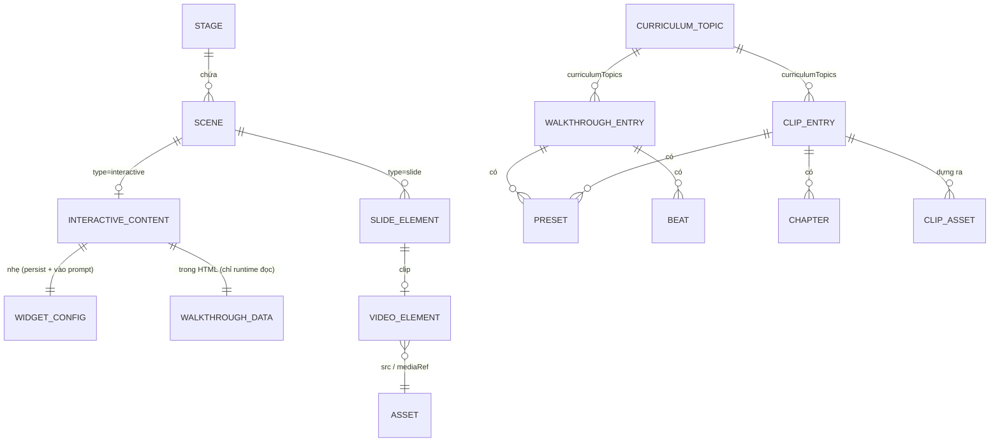

# Mô hình dữ liệu

- **Trạng thái**: Accepted — mô hình mới (catalog, manifest, store tạm) là thiết kế; phần DSL/asset hiện có lấy từ code (sửa 2026-09-30 theo ADR 0011–0013)
- **Ngày**: 2026-09-30
- **Người sở hữu**: Chủ dự án
- **Liên quan**: [ARCHITECTURE §6, §8b](ARCHITECTURE.md), [INTERFACES](INTERFACES.md), [OPERATIONS §4](OPERATIONS.md), [ADR 0001](decisions/0001-step-engine-immutable.md), [ADR 0006](decisions/0006-deterministic-trace-catalog.md), [ADR 0007](decisions/0007-manim-and-math-visualization.md)

> **Tóm tắt:** tính năng **không thêm bảng cơ sở dữ liệu** và **không đổi DSL** của OpenMAIC. Dữ liệu học sinh (ADR 0014) nằm trong kho runtime sẵn có, bằng kind mới `tutorLearning` (§8). Dữ liệu mới nằm ở ba nơi: (1) **mã** (catalog entry, hàm thuần), (2) **scene hiện có** (`InteractiveContent.html` + `widgetConfig` nhẹ, hoặc slide có `PPTVideoElement`), (3) **file dữ liệu** (curriculum, manifest/clip-sheet của clip). Nguồn sự thật của nội dung dạy là catalog trong mã; scene lưu bản sinh ra.

## 1. Bản đồ dữ liệu



| Nhóm | Thực thể | Ở đâu | Nguồn sự thật | Trạng thái |
| --- | --- | --- | --- | --- |
| Hiện có | Stage, Scene, `InteractiveContent`, `PPTVideoElement`, Asset | `@openmaic/dsl`, asset pool/server | DSL và kho asset | Đã có |
| Mới (mã) | `WalkthroughEntry` (`beatDefs`, `problem?`, code C++/Python), `ClipEntry`, `InputSpec`, `Messages` | `lib/subjects/<id>/…`, `lib/clips/` | **Mã** trong git | Thiết kế |
| Mới (trong scene) | `widgetConfig` nhẹ (có `entryRev`), `walkthrough-data`; slide clip có `PPTVideoElement` | HTML của scene / slide | Sinh từ entry lúc tool tạo scene (ADR 0011) | Thiết kế |
| Mới (file dữ liệu) | Curriculum, clip manifest, clip-sheet | `references/curriculum/`, cạnh mp4 | File trong git / kho asset | Thiết kế |
| Tạm | `widget-runtime-state` (`ready`, `desired`, trạng thái học sinh) | Store trình duyệt (`lib/store/`) | Không persist | Thiết kế |
| **Dữ liệu học sinh** (ADR 0014) | Kind runtime `chat`, `quizAttempt` (đã có) + `tutorLearning` (mới) | Kho runtime phía server (Postgres) | Bản ghi append-only | Thiết kế |
| Kết quả hội đồng LLM | `reviews/<entryId>@<entryRev>.json` | `lib/subjects/<id>/reviews/` (git) | Mã/dữ liệu trong git | Thiết kế |

## 2. Thực thể hiện có được tái dùng (đã đọc code)

| Thực thể | Trường liên quan | Nguồn |
| --- | --- | --- |
| `InteractiveContent` | `type:'interactive'`, `html` (srcDoc), `url?`, `widgetType?` (union đóng), `widgetConfig?` (`type` ∈ `WidgetType`, khoá còn lại mở) | `packages/@openmaic/dsl/src/interactive.ts` |
| `PPTVideoElement` | `type:'video'`, `src?`, `mediaRef?`, `autoplay`, `poster?`, `ext?` | `packages/@openmaic/dsl/src/slides.ts:736` |
| `PlayVideoAction` | `elementId` (không seek/beat) | `packages/@openmaic/dsl/src/action.ts:190` |
| Trần asset server | asset ≤32 MiB, request ≤33 MiB, meta ≤64 KiB, ≤8 phần | `packages/@openmaic/storage/src/server/asset.ts:108-111` |
| Asset pool trình duyệt | IndexedDB `maic-asset-pool` (+ Dexie `mediaFiles`) | `lib/media/asset-pool.ts:18` |
| `scene-builder` | chép nguyên `widgetConfig` vào scene | `packages/@openmaic/generation/src/scene-builder.ts:92-93` |

**Ràng buộc DSL đã biết:** `WidgetType` là union đóng và bị `validateScene` từ chối giá trị lạ → dùng vỏ `widgetType:'simulation'` + `widgetConfig.kind`. `widgetConfig` không được chứa object có `type ∈ {text, shape, table, latex}` và không có khoá `teacherActions` (`lib/edit/slide-schema.ts:56-59`; object `type` bị `sanitize-scene-content.ts:251-274` xử lý). schema sinh ra (`packages/@openmaic/dsl/dist/schema/scene.schema.json`, `stage.schema.json`; `dist/` không nằm trong git) có `additionalProperties:false` [Inference: theo báo cáo kiểm toán] nên **không thêm trường mới** vào DSL.

## 3. Dữ liệu trong scene walkthrough

Hai khối JSON trong HTML tự chứa (ARCHITECTURE §6). Trường bắt buộc theo ADR 0013 §5.

```jsonc
// <script type="application/json" id="widget-config">  — NHẸ: lưu vào widgetConfig + vào prompt
{
  "type": "simulation", "kind": "walkthrough",
  "walkthroughId": "binary-search", "entryRev": 3, "contentHash": "9e8d7c6b5a493827", "subject": "cp", "visualizer": "array",
  "locale": "vi-VN", "presetId": "mid-hit", "panel": "cpp",
  "presets": [{ "id": "mid-hit", "label": "Trúng ở giữa", "total": 9, "framesHash": "a1b2c3d4e5f60718" },
              { "id": "first", "label": "Ở đầu mảng", "total": 12, "framesHash": "…" },
              { "id": "absent", "label": "Không có", "total": 14, "framesHash": "…" },
              { "id": "single", "label": "Một phần tử", "total": 4, "framesHash": "…" }],
  "beats": [{ "id": "start", "occurrence": 1, "frame": 0 }, { "id": "mid", "occurrence": 1, "frame": 1 },
            { "id": "done", "occurrence": 1, "frame": 8 }],          // của presetId
  "runtimeVersion": 1
  // "llmInput": { … }   ← chỉ từ lát 1d (ADR 0013 §9); khi có thì presets[] thêm { "id": "llm", "label": "…", "total": n, "framesHash": "…" }
}
```

```jsonc
// <script type="application/json" id="walkthrough-data">  — ĐẦY ĐỦ: chỉ runtime đọc, KHÔNG vào prompt
{
  "title": "Binary Search", "locale": "vi-VN",
  "sets": {
    "mid-hit": { "frames": [ /* Frame[] */ ], "beats": [{ "id": "start", "occurrence": 1, "frame": 0 }, { "id": "mid", "occurrence": 1, "frame": 1 }] },
    "first":   { "frames": [ /* … */ ], "beats": [ /* … */ ] }
    // "llm": { … }  ← chỉ từ lát 1d: input do LLM cấp khi sinh bài, đã qua InputSpec
    // ("student" không bao giờ nằm ở đây: input học sinh chỉ ở bộ nhớ runtime)
  },
  "beatText": { "start": { "label": "Bắt đầu", "ask": "…" } },    // nhãn hiển thị; KHÔNG dùng cho Q&A
  "code": { "pseudo": ["…"], "impl": { "cpp": ["…"], "py": ["…"] }, "map": { "cpp": { "1": [2] }, "py": { "1": [2] } } },
  "labels": { "play": "Phát", "pause": "Tạm dừng" }
}
```

`sets[p].beats` liệt kê các beat **thật sự xảy ra** ở preset `p`, theo thứ tự, cho phép lặp (`occurrence`). `actions()` duyệt danh sách này (ADR 0013 §4).

| Trường | Kiểu | Ràng buộc |
| --- | --- | --- |
| `Frame.state` | dữ liệu thuần theo visualizer | JSON-safe; không hàm/`Map`/`undefined`; bất biến |
| `Frame.meta.index` | int | liên tục từ 0 |
| `Frame.meta.explanation` | string | ≤160 ký tự; theo `locale` |
| `Frame.meta.codeLine` | int? | dòng pseudocode hợp lệ (1-based) |
| `Frame.meta.highlights/pointers/vars/aux/tags` | xem ADR 0001 | key do visualizer định nghĩa; tag `beat:<id>` |
| `beatDefs` (catalog) | 5–10 định nghĩa | mỗi cái dùng ở ≥1 preset; `required` có ở mọi preset; kịch bản kể ≤ 12 beat/scene |
| `presets` | ≥4, ≤6, gồm ≥1 biên | `total` = số frame; tổng frame mọi preset ≤ 300 (đề xuất [Inference]); mỗi preset ≤ `maxFrames` |
| `entryRev`, `framesHash`, `contentHash` | int; 16 ký tự hex (sha256 cắt ngắn của frames JSON chuẩn hoá, theo từng **(preset, locale)** vì `explanation` theo locale; `widgetConfig` mang hash của locale của scene); 16 ký tự hex (băm `code`, `beatDefs`, `presets[].input`, `problem`) | test snapshot: hash nào đổi thì `entryRev` phải tăng |
| `code.map.cpp`, `code.map.py` | pseudo → dòng cài đặt | **toàn phần** cho từng ngôn ngữ, có test |
| `input` (1d) | theo `InputSpec` | ≤ 2048 byte UTF-8 của `JSON.stringify(input)` |
| kích thước HTML | ≤ `maxBytes` của entry | đo bằng số byte UTF-8 của HTML đã dựng; vượt → tool trả lỗi, không ghi |

## 4. Dữ liệu clip (Toán)

`ClipEntry` (kiểu ở ARCHITECTURE §8b) là **mã**. Các file do CI sinh ra cạnh mỗi mp4:

```jsonc
// manifest.json — một tệp cho cả clip; mỗi chapter một file mp4
{ "clipId": "amgm-semicircle", "contentHash": "sha256:…", "engineVersion": "manim-ce 0.21.0", "templateRev": 1,
  "imageDigest": "sha256:…", "profile": "qm-720p30", "w": 1280, "h": 720, "fps": 30, "durationSec": 30.0,
  "chapters": [ { "id": "dung", "file": "dung.mp4", "posterFile": "dung.png", "startSec": 0, "endSec": 12, "sizeBytes": 800000 } ],
  "master": { "file": "master.mp4", "sizeBytes": 2400000 } /* tuỳ chọn */ }
// clip-sheet.json (cho thầy Q&A) — CI chép từ ClipEntry.sheet (nguồn chính thức nằm trong mã); Q&A đọc ClipEntry.sheet, file này chỉ đi kèm asset khi export
{ "chapters": [{ "id": "dung", "shows": "nửa đường tròn đường kính a+b", "formulas": ["h^2 = ab"],
    "misconceptions": ["h là trung bình cộng"], "hints": ["…", "…"] }] }
```

| Khoá / quy tắc | Nội dung |
| --- | --- |
| **Cache key (định nghĩa duy nhất)** | `sha256(canonicalJSON([1, templateId, templateRev, paramsCanon, localeOrNull, profile, imageDigest]))`. `paramsCanon`: số lượng tử hoá theo `step` của `InputSpec` rồi chuẩn hoá (khoá sắp xếp, số không dấu `+`, không `-0`). `localeOrNull` = `null` nếu clip không có chữ nướng theo locale. `profile` = `qm-720p30`. `templateRev` và `imageDigest` do dịch vụ/CI cấp (INTERFACES §6) |
| Định danh | `templateId` = `ClipEntry.id` = `clipId` (một mẫu, một id) |
| Tên asset | băm nội dung; phục vụ `immutable` |
| **Lưu giữ** | asset clip **đã phát hành không bao giờ bị xoá** hay ghi đè, vì lớp học đã lưu tham chiếu tới nó. Dựng lại không cho kết quả giống từng bit (ADR 0007), nên mất asset là mất URL → sao lưu (OPERATIONS §5) |
| Bất biến | `entry.chapters` khớp `manifest.chapters` (test); `invariants(params)` đúng trên mọi preset |
| Đặt tên phần tử video | mỗi chapter một slide, một phần tử: `name: 'clip:<id>@<hash>#<chapterId>'` để Q&A tra `clip-sheet` |

`ClipEntry.asset(presetId | params, locale)` trả `{ master?, chapters: [{ id, url, poster }] } | null` (`null` = chưa dựng → `clip-not-prebuilt` ở 3A, render ở 3C).

Vòng đời clip:
1. **CI dựng** clip.
2. Asset băm tên được lưu: repo (≤10 clip) / volume / S3.
3. Lần dùng đầu tiên, clip được **adopt** vào asset pool.
4. Clip nằm trong ZIP lớp học; khi import, clip được ghi lại vào asset pool.

Không xoá asset đã phát hành (trên).

## 5. Curriculum

File dữ liệu; hình dạng lấy từ `docs/tutor/curriculum/curriculum-informatics-vn.json` (đã đối chiếu 32 topic):

| Cấp | Trường |
| --- | --- |
| Gốc | `version`, `locale`, `subject`, `title_vi`, `title_en`, `exam_targets`, `audience`, `course_shape`, `difficulty_scale`, `tiers`, `sequencing`, `sources`, `exam_profile` (có `ts10_format_vi` [Unverified]), `provenance`, `tracks_def` |
| Tier | `id` (`tier-N`), `name_vi`, `grade_band`, `topics[]` |
| Topic | `id`, `name_vi`, `name_en`, `difficulty` (1–5), `tracks` (`ts10` \| `hsg`, ADR 0012), `est_scenes`, `prerequisites[]`, `subtopics[]`, `typical_problems[]`, `pitfalls[]`, `interactive_ideas[]`, `vn_sources[]`, `exam_relevance` |
| Mới cho Toán | `primary_medium`: `manim` \| `walkthrough` \| `slide` |

**Bất biến (test `curriculum-map.test.ts`):** `id` duy nhất; mọi topic có `tracks` khác rỗng; mọi `prerequisites` tồn tại; không vòng; không phụ thuộc tier cao hơn; `sequencing` liệt kê đủ mọi topic (bản Tin hiện có: 32/32 sau khi bổ sung `t4-geometry`, `t4-game-theory`); `index.json` khớp `tier-N.json`.

**Vị trí:** tạm ở `docs/tutor/curriculum/`; ở Phase 2/3 chuyển vào `skills/agent-runtime/<skill>/references/curriculum/` (chia theo tier + `index.json`) vì công cụ `read` của agent chỉ đọc trong thư mục skill có `SKILL.md` và test buộc mọi thư mục dưới `skills/agent-runtime` là skill.

## 6. Trạng thái tạm (không persist)

| Dữ liệu | Nơi | Vòng đời |
| --- | --- | --- |
| `widget-runtime-state` `{ sceneId → { ready, desired, state: { preset, frame, input?, prediction? } } }` | Store `lib/store/widget-runtime-state.ts` | `desired` là `SET_WIDGET_STATE` cuối, **giữ lại** khi iframe bị đẩy khỏi pool (để gửi lại khi `ready`). `state` của học sinh **xoá** khi `srcDoc` đổi hoặc iframe dựng lại. Chỉ giữ giá trị cuối |
| Job render clip (đợt 3C) | Bộ nhớ `manim-service` | TTL (theo mẫu `RENDER_JOB_TTL_MS`); mất khi restart → idempotent nhờ cache key + gộp job trùng khoá |
| Trạng thái player (`index`, `isPlaying`, `speed`) | Bộ nhớ trong iframe + `data-*` của `#wt-root` | Mất khi tải lại iframe; hồi phục từ `desired` |

## 7. Tính nhất quán và di trú

- **Phiên bản runtime:** `widget-config.runtimeVersion` (int). Scene cũ giữ runtime cũ vì HTML tự chứa, nên nâng runtime **không** cần di trú scene cũ.
- **Phiên bản entry** (ADR 0013 §6): `entryRev` + `framesHash` trong `widgetConfig`.
  - Q&A tính lại từ catalog chỉ khi khớp; lệch thì chỉ trả digest tĩnh.
  - Scene vẫn phát bình thường.
  - Muốn nội dung mới thì sinh lại scene bằng `generate_walkthrough`.
- **Đổi `kind` sang widget hạng nhất (E2)** là thay đổi duy nhất cần di trú (`widgetType:'simulation'`+`kind:'walkthrough'` → `walkthrough`), và chỉ khi kích hoạt trigger ADR 0005.
- **Đổi catalog:**
  - Entry mới thêm được tự do.
  - **Đổi `id`** làm scene cũ mất liên kết Q&A (scene vẫn phát vì HTML tự chứa). Vì vậy không đổi `id` đã phát hành; bảo đảm bằng test snapshot danh sách `id` (`tests/subjects/ids-snapshot.test.ts`, đề xuất — TEST-STRATEGY §3).
  - `id` phải duy nhất trên mọi gói (ADR 0013 §1).
- **Đổi mẫu clip:** tăng `templateRev` → cache key mới → clip mới. Clip cũ vẫn dùng được trong lớp đã lưu và **không bị xoá**.

## 8. Dữ liệu học sinh (ADR 0014)

| Dữ liệu | Kind runtime | Có sẵn? | Ghi chú |
| --- | --- | --- | --- |
| Tin nhắn chat với thầy | `chat` | Đã có validator (`lib/runtime/payload-validators.ts:6-17`) | Đường ghi chat vào kho runtime ở mọi màn học: [Unverified], spike Q15 |
| Lượt làm quiz | `quizAttempt` | Đã có (`lib/runtime/payload-validators.ts:19-30`) | — |
| Beat đã tới, dự đoán, gợi ý, đánh giá, nhãn lọc | `tutorLearning` | **Mới** | Hình dạng ở [INTERFACES §8.3](INTERFACES.md) |

- **Vì sao không thêm bảng:** `RuntimeSession.kind` là chuỗi mở; app tự định nghĩa kind và validator (`packages/@openmaic/dsl/src/runtime.ts:152-157`; `packages/@openmaic/storage/src/runtime/types.ts:21-23`).
- **Lưu giữ:** không tự xoá. Xoá theo yêu cầu: công cụ vận hành xoá mọi phiên của một `learnerKey` [Unverified: API xoá phiên của `RuntimeStore` cần kiểm ở spike Q15]. Sao lưu cùng Postgres (OPERATIONS §5).
- **Bỏ định danh khi phân tích:** `tutor-analyst` chỉ nhận số tổng hợp theo entry/beat (đếm, tỉ lệ), không nhận `learnerKey` hay nguyên văn chat.
- **Không lưu:** nguyên văn nội dung bị bộ lọc chặn (chỉ lưu nhóm vi phạm); khoá API; dữ liệu định danh ngoài tài khoản sẵn có.
