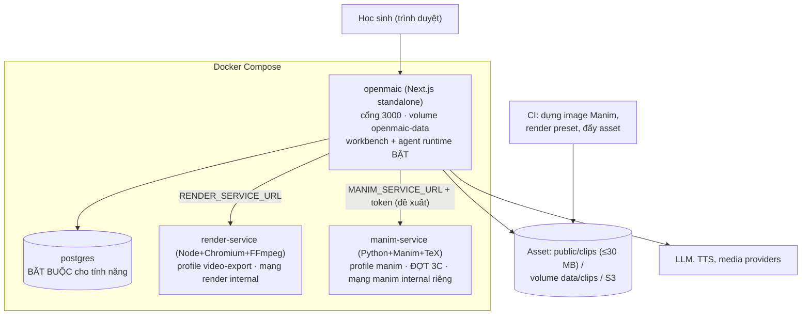

# Triển khai và vận hành

- **Trạng thái**: Accepted — phần *Đề xuất* chưa triển khai; phần *Đã có* lấy từ repo hiện tại (sửa 2026-09-30 theo review: điều kiện workbench, cờ mặc định chặn, sao lưu asset clip, cách ly `manim-service`, CI)
- **Ngày**: 2026-09-30
- **Người sở hữu**: Chủ dự án (DevOps)
- **Liên quan**: [ARCHITECTURE](ARCHITECTURE.md), [NFR](NFR.md), [SECURITY](SECURITY.md), [TEST-STRATEGY](TEST-STRATEGY.md), [RISKS](RISKS.md), [ADR 0007](decisions/0007-manim-and-math-visualization.md), [ADR 0010](decisions/0010-no-student-code-enforcement.md), [ADR 0011](decisions/0011-entry-point-workbench-tool.md)

> **Tóm tắt:**
> - SubjectTutor **chỉ chạy khi bật workbench**: `OPENMAIC_AGENT_RUNTIME_ENABLED=true` + `DATABASE_URL` (Postgres) + cờ build-time `NEXT_PUBLIC_PRO_WORKBENCH_ENABLED=true`. Vì vậy triển khai này **luôn có server persistence** và **phải sao lưu Postgres + kho asset**.
> - Chuyên Tin không thêm dịch vụ nào khác.
> - Chuyên Toán thêm hai thành phần tuỳ chọn: pipeline dựng clip bằng CI (3A) và container `manim-service` (3C).
> - Widget `code` **mặc định bị chặn**, không cần đặt cờ.
> - Mọi thành phần tuỳ chọn suy giảm êm khi vắng mặt.

## 1. Topology triển khai



| Thành phần | Trạng thái | Bắt buộc? | Ghi chú |
| --- | --- | --- | --- |
| `openmaic` | Đã có | Có | `Dockerfile` 4 stage (`base`, `deps`, `builder`, `runner`); `next.config.ts`: `output: 'standalone'`. **Phải dựng với `NEXT_PUBLIC_PRO_WORKBENCH_ENABLED=true`** |
| `postgres` | Đã có (profile) | **Có** (agent runtime cần `DATABASE_URL`, `lib/config/feature-flags.ts:18-25`) | Chứa tài liệu lớp học, runtime rows, asset (khi dùng kho server) |
| `render-service` | Đã có (profile `video-export`) | Không | Export MP4; vắng mặt → tải ZIP |
| Pipeline dựng clip (CI) | Đề xuất (3A) | Chỉ cho Toán | Ngoài Dockerfile ứng dụng; xem §3 |
| `manim-service` | Đề xuất (3C) | Không | Render theo yêu cầu; vắng mặt → chỉ clip dựng sẵn |

## 2. Cấu hình

`Đã có` = biến đã tồn tại trong `.env.example`/code. `Đề xuất` = biến mới, cần thêm khi triển khai.

| Biến | Mặc định | Tác dụng | Trạng thái |
| --- | --- | --- | --- |
| `OPENMAIC_AGENT_RUNTIME_ENABLED` | tắt | **Bắt buộc bật**: chạy agent runtime (đường duy nhất tạo walkthrough, ADR 0011) | Đã có (`.env.example:347`) |
| `DATABASE_URL` | không đặt | **Bắt buộc**: runtime chỉ chạy khi có URL khác rỗng | Đã có (`.env.example:353`) |
| `NEXT_PUBLIC_PRO_WORKBENCH_ENABLED` | tắt | **Bắt buộc bật lúc build**: hiện workbench; thiếu thì `/workbench` trả 404 (`middleware.ts:55-58`). **Cần thêm vào `ARG`/`ENV` của `Dockerfile` (`:51-72`) và `build.args` của compose (`docker-compose.yml:5-22`)**, vì hiện chưa có | Đã có (biến); Đề xuất (Dockerfile/compose) |
| `OPENMAIC_ALLOW_CODE_WIDGET` | **không đặt = chặn** widget `code` toàn ứng dụng | Đặt `true` chỉ khi triển khai muốn hành vi upstream (có code editor). Không có biến `NEXT_PUBLIC_*` tương ứng; client hỏi server (ADR 0010) | Đề xuất |
| `OPENMAIC_DISABLE_WIDGET_PROVIDERS` | không đặt | Kill-switch: không đăng ký tool `generate_walkthrough`/`generate_clip_scenes` (§10) | Đề xuất |
| `MODEL_ROUTES` (thêm stage, ADR 0014) | không đặt | Model cho từng vai trò LLM: `tutor-moderation`, `tutor-review-cp`, `tutor-review-cp-2`, `tutor-review-math`, `tutor-review-math-2`, `tutor-review-code`, `manim-author`, `sim-learner`, `tutor-analyst`. **Thiếu route thì tính năng phụ thuộc tắt** (thiếu `tutor-moderation` → chat học sinh bị chặn). Khuyến nghị hai nhà cung cấp khác model dạy | Đề xuất (biến đã có: `lib/server/model-routes.ts:132-168`) |
| `MANIM_SERVICE_URL`, `MANIM_SERVICE_TOKEN` | không đặt | Địa chỉ + token của `manim-service`; không đặt → render theo yêu cầu tắt (`clip-render-unavailable`) | Đề xuất |
| `MANIM_MAX_CONCURRENCY`, `MANIM_MAX_QUEUE`, `MANIM_MAX_JOBS_PER_USER`, `MANIM_MAX_GLOBAL`, `MANIM_JOB_TTL_MS`, `MANIM_JOB_DEADLINE_MS` | tính theo §8 | Số job chạy đồng thời (= số worker); số job chờ; giới hạn mỗi owner; **tổng job đang chờ + đang chạy** toàn dịch vụ; TTL; hạn tối đa mỗi job | Đề xuất |
| `RENDER_SERVICE_URL` | không đặt | Bật export MP4 một chạm; container render nằm trên mạng `render` (`internal: true`) | Đã có |
| `RENDER_MAX_QUEUE` (20), `RENDER_MAX_JOBS_PER_USER` (1), `RENDER_JOB_TTL_MS` (1 800 000), `RENDER_JOB_DEADLINE_MS` (2 700 000) | như trong ngoặc | Tham khảo; **không chép** cho `MANIM_*` (thời gian job khác) | Đã có |
| `NEXT_PUBLIC_PERSISTENCE`, `PERSISTENCE_DEV_TOKEN` | không đặt | Server persistence (Postgres/S3), trần asset 32 MiB | Đã có |
| `ASSET_S3_BUCKET` (và cặp biến S3) | không đặt | Kho asset S3 cho clip khi vượt ngân sách repo | Đã có (`.env.example:519`; dùng lại) |
| `ASSET_QUOTA_BYTES` | 10 GiB; `0` = tắt (`README.md:418-423`) | Trần tổng dung lượng asset mỗi principal (có test `tests/persistence/asset-quota.test.ts`) | Đã có |
| `ALLOW_LOCAL_NETWORKS` | tắt | Chỉ bật cho mô hình tự host; **không bật trên triển khai công khai** | Đã có |
| `ALLOWED_FRAME_ANCESTORS` | rỗng | CSP `frame-ancestors` thêm nguồn tin cậy (build-time) | Đã có |
| `ACCESS_CODE` | không đặt = **mọi thứ mở** (`middleware.ts:60-63`) | Cookie access-code; `/api/*` trả 401 nếu thiếu. **Bắt buộc đặt** cho triển khai học sinh (SECURITY T26) | Đã có |
| `LOG_LEVEL`, `LOG_FORMAT` | `info`, `pretty`; `LOG_FORMAT=json` cho log có cấu trúc (`lib/logger.ts:10`) | Mức và định dạng log | Đã có |
| `OPENMAIC_AGENT_TOOL_TIMEOUT_MS` | mặc định của runtime | Trần thời gian của tool agent | Đã có |

**Cấu hình model theo vai trò** (ADR 0014 quyết định 8; user chọn DeepSeek V4.1 flash + GPT-6-luna). Định danh model dưới đây là **tạm, [Unverified]**; lấy tên chính xác từ danh sách model của nhà cung cấp (spike Q16):

```bash
OPENAI_API_KEY=...            # GPT-6-luna
OPENAI_MODELS=gpt-6-luna      # tên chính xác: [Unverified]; danh mục repo hiện có gpt-5.6-luna
DEEPSEEK_API_KEY=...          # DeepSeek V4.1 flash
DEEPSEEK_MODELS=deepseek-v4.1-flash   # tên chính xác: [Unverified]; ví dụ trong repo là deepseek-v4-flash
MODEL_ROUTES='{
  "maic-agent-driver": {"model": "openai:gpt-6-luna", "api": "openai-responses"},
  "maic-agent": "openai:gpt-6-luna",
  "chat-adapter": "openai:gpt-6-luna",
  "manim-author": "openai:gpt-6-luna",
  "tutor-moderation": "deepseek:deepseek-v4.1-flash",
  "tutor-review-cp": "deepseek:deepseek-v4.1-flash",
  "tutor-review-math": "deepseek:deepseek-v4.1-flash",
  "tutor-review-cp-2": "openai:gpt-6-luna",
  "tutor-review-math-2": "openai:gpt-6-luna",
  "tutor-review-code": "deepseek:deepseek-v4.1-flash",
  "sim-learner": "deepseek:deepseek-v4.1-flash",
  "tutor-analyst": "deepseek:deepseek-v4.1-flash"
}'
DEFAULT_MODEL=openai:gpt-6-luna
```

Giá trị `api` của `maic-agent-driver` phải là `openai-completions` hoặc `openai-responses` (`.env.example:355-365`); chọn cái nào tuỳ model hỗ trợ (spike Q16). Các stage `tutor-*`, `manim-author`, `sim-learner` phải được thêm vào `LLM_STAGES` trước (`lib/server/model-routes.ts:132-154`); nếu chưa thêm, route của chúng không được nhận [Inference].

Quy tắc: `NEXT_PUBLIC_*` biên dịch vào bundle trình duyệt (compose truyền qua `build.args`); không đặt bí mật vào đó.

**Danh tính cho giới hạn mỗi người:** `render-service` chỉ có danh tính thật khi `TRUST_PROXY_HEADERS=true` sau reverse proxy; nếu không, mọi client chung một danh tính (`render-service/README.md`), và `docker-compose.yml` vì vậy đặt `RENDER_MAX_JOBS_PER_USER=0`. `manim-service` **không** dựa vào IP: app gửi owner id của phiên (như luồng preview, `render-service/README.md:138-141`) kèm trần toàn cục.

## 3. Build, phát hành và CI

- **Ứng dụng:** `pnpm build`. Docker deps stage chỉ COPY `packages/` và `scripts/` trước `pnpm install` (`Dockerfile:34-36`), nên **mọi thứ tạo từ `lib/`** (module runtime walkthrough) phải là **file sinh sẵn được commit**, không build ở `postinstall`. Lệnh sinh: `node scripts/generate-tutor-runtime.mjs` (tên đề xuất).
- **Không đổi package:** `packages/@openmaic/*` giữ nguyên nên không bump/publish (`git diff --name-only origin/main -- packages/@openmaic` rỗng).
- **CI hiện có** (`.github/workflows/ci.yml`):
  - job `check`: Prettier, ESLint, TypeScript, i18n, version bumps, unit tests;
  - job `render-service`: typecheck, test, build image;
  - job `e2e`: build, Playwright, và **browser test chạy từng file một ở step riêng có cờ môi trường** (`.github/workflows/ci.yml:271-279`).
- **Trigger CI:** `push` chỉ cho `main` và các nhánh integration; `pull_request` chỉ vào danh sách nhánh cố định (`.github/workflows/ci.yml:3-19`). Nhánh tính năng merge local **không có CI**. Cách xử lý: mở PR vào `main` của fork (origin), hoặc chạy đủ lệnh ở TEST-STRATEGY §7 trước khi merge local.
- **CI cần thêm (đề xuất):**
  - (a) Mỗi `*.browser.test.ts` mới **một step riêng** trong job `e2e` kèm cờ; test `tests/ci/browser-steps.test.ts` so danh sách file browser test với `ci.yml`.
  - (b) Đặt `OPENMAIC_AGENT_RUNTIME_ENABLED`, `NEXT_PUBLIC_PRO_WORKBENCH_ENABLED` cho bước `pnpm build` và `webServer.env` của Playwright (`playwright.config.ts:35`) khi e2e cần workbench.
  - (c) Job dựng image Manim (`manim/Dockerfile`, ghim digest) + pytest + cổng QA.
  - (d) `scripts/render-clips.mjs` dựng **chỉ các preset trượt cache**, chia shard.
  - (e) Test kiểm độ mới của module runtime sinh sẵn; test kích thước `public/clips`.
  - (f) `python3 docs/tutor/tools/check_docs.py` trong job `check`.
  - (g) Job `TUTOR_IMPL_CHECK=1` chạy bản cài đặt C++/Python trên preset (Phase 2 §7).
- **Nhánh và commit:** làm trên nhánh tính năng tạo từ `origin/main`, **không đẩy từ `main` cục bộ** (`branch.main.remote` đang là `upstream`, tức THU-MAIC). Commit theo quy ước `type(scope): mô tả`. Không mở PR lên upstream.
- **Loại `manim/` khỏi công cụ JS** (như `render-service`): `tsconfig.json` (mục `exclude`), `tsconfig.build.json`, `eslint.config.mjs` (ignore `manim/**`), `.dockerignore`.

## 4. Lưu trữ asset và dung lượng

| Kho | Trần / ghi chú | Dùng cho |
| --- | --- | --- |
| Asset pool (IndexedDB `maic-asset-pool`) | theo trình duyệt | Blob clip sau khi *adopt*; nguồn để ZIP/MP4/import hoạt động |
| Server persistence (Postgres/S3) | ≤32 MiB/asset, request 33 MiB (`packages/@openmaic/storage/src/server/asset.ts:108-109`); tổng quota theo `ASSET_QUOTA_BYTES` (mặc định 10 GiB mỗi principal, `README.md:418`) | Luôn bật trong triển khai này |
| File server `data/classrooms/<id>/media` | route Range `/api/classroom-media`; trần 200 MB (agent), 100 MB (classic) [theo chuyên gia] | Video sinh bởi provider |
| `public/clips/` | ≤10 clip, ≤30 MB tổng; tăng trưởng lịch sử git ≤100 MB (NFR-P8). `public/` chiếm ≈ 3,8 MB **được git theo dõi** (9,2 MB trên đĩa gồm phần bị ignore); không Git LFS. **Tệp tĩnh không qua access-code** (SECURITY T21) | Thư viện clip dựng sẵn nhỏ |
| Volume `data/clips` hoặc S3 | không giới hạn cứng | Thư viện lớn hơn; tên file băm nội dung + `immutable`; **không xoá asset đã phát hành** |

Xuất ZIP lớp học dựng `JSZip` rồi `generateAsync({type:'blob'})` **trong RAM** (`lib/export/use-export-classroom.ts:86,245`). Cảnh báo 200 MB nằm ở phía **import** (`lib/import/use-import-classroom.ts:361-364`, chỉ `log.warn`). Vì vậy giữ ≤ 6 clip/bài và chapter ≤ 3 MB để export/import không nghẽn.

## 5. Sao lưu và khôi phục

| Dữ liệu | Sao lưu | Khôi phục |
| --- | --- | --- |
| Postgres (**bắt buộc** trong triển khai này; chứa **dữ liệu học sinh**: chat, quiz, `tutorLearning`, lưu không tự xoá theo ADR 0014) | `pg_dump` định kỳ, **mã hoá bản sao lưu** | Restore; xoá theo `learnerKey` khi có yêu cầu (công cụ vận hành, spike Q15) |
| Kho asset (S3 / volume `data/clips`, `openmaic-data`) | Sao lưu định kỳ; **asset clip đã phát hành không bao giờ xoá/ghi đè** | Khôi phục volume/bucket |
| Thư viện clip | **Phải sao lưu asset đã phát hành.** Dựng lại từ nguồn chỉ cho kết quả *tương đương*, không giống từng bit (ADR 0007), nên URL băm nội dung cũ sẽ 404 nếu mất asset | Khôi phục từ sao lưu; dựng lại bằng CI chỉ để tạo **phiên bản mới** |
| Cấu hình (`.env.local`) | Lưu ngoài repo, có kiểm soát truy cập | Khôi phục thủ công |
| Curriculum, catalog | Nằm trong git (sau khi commit) | `git` |
| Dữ liệu chỉ ở IndexedDB (nếu người dùng mở lớp học không qua server) | **Không được sao lưu phía server**; mất khi trình duyệt xoá dữ liệu | Khuyến nghị học sinh dùng lớp học lưu trên server |

**RPO/RTO: chưa đặt**, cần người vận hành quyết định theo mức quan trọng của dữ liệu lớp học. Asset clip đã phát hành **tính vào RPO** (sửa 2026-09-30).

## 6. Giám sát và cảnh báo

**Đã có:** log qua `LOG_LEVEL`/`LOG_FORMAT` (`LOG_FORMAT=json`, `lib/logger.ts:10`); `/health` của `render-service` (`accepting`, hồ sơ tài nguyên).

**Đề xuất:** repo **không có backend metric** (không `prom-client`/OpenTelemetry), và ADR 0002 cấm thêm dependency. Vì vậy các sự kiện dưới được ghi thành **log có cấu trúc** (`LOG_FORMAT=json`); người vận hành đếm/cảnh báo bằng công cụ log của họ. **Repo không tự đánh giá cảnh báo.** Cột "Nên cảnh báo khi" là gợi ý cấu hình cho người vận hành. `/health` của `manim-service` có thêm các bộ đếm hàng đợi.

Schema chung của sự kiện:

```json
{ "level": "info", "event": "walkthrough_generated", "walkthroughId": "binary-search", "entryRev": 1, "presetId": "mid-hit", "ms": 42, "bytes": 38120, "sessionOwner": "owner-hash" }
```

| Sự kiện | Ý nghĩa | Nên cảnh báo khi |
| --- | --- | --- |
| `walkthrough_generated` (`ms`, `bytes`) | Hiệu năng tạo, kích thước | p95 `ms` vượt NFR-P1; `bytes` vượt NFR-P2 |
| `walkthrough_invalid_id`, `walkthrough_invalid_input` | LLM chọn sai id/input | tăng đột biến (SKILL.md lệch catalog) |
| `frame_cap_exceeded` | `RangeError` vượt trần frame/step | > 0 kéo dài |
| `code_widget_blocked` (`layer`: render/tool/classic), `code_widget_stored` | Chặn `code` hoạt động; lớp học import có `code` | `layer=tool` tăng: kiểm prompt/template gán `code` |
| `widget_ready_timeout` | Iframe không báo `ready` trong 5 s | > 1% lượt phát |
| `clip_render_done` (`seconds`), `clip_render_failed` | Render Manim | `seconds` > 180 hoặc tỉ lệ `failed` > 5% |
| `manim_queue_depth`, `manim_429` | Tải dịch vụ | hàng đợi gần `MANIM_MAX_QUEUE` |
| `widget_state_reported` | Kênh Q&A hoạt động | về 0 sau khi triển khai 1c |
| `moderation_verdict` (`direction`, `allow`, `categories`, `ms`), `moderation_failed_closed` | Bộ lọc hoạt động | tỉ lệ chặn đột biến; `ms` p95 > 1500; `failed_closed` > 0 kéo dài |
| `review_verdict` (`entryId`, `entryRev`, `pass`, `models`) | Hội đồng LLM | tỉ lệ trượt tăng; bất đồng giữa hai model > 20% |
| `llm_role_tokens` (`stage`, `in`, `out`) | Chi phí từng vai trò | vượt ngân sách |

Ví dụ truy vấn (với `jq` trên log JSON): `jq -c 'select(.event=="code_widget_blocked") | .layer' app.log | sort | uniq -c`.

## 7. Runbook

| Triệu chứng | Nguyên nhân có thể | Cách xử lý |
| --- | --- | --- |
| Không có workbench / `/workbench` 404 | Thiếu một trong ba điều kiện (ADR 0011); image dựng không có `NEXT_PUBLIC_PRO_WORKBENCH_ENABLED` | Kiểm `/api/agent/runtime`; dựng lại image với build arg; kiểm `DATABASE_URL` |
| Agent trả lỗi `invalid-walkthrough-id` kèm `validIds` | SKILL.md lệch catalog; LLM bịa id | Chạy lại sinh khối id từ catalog; xem test `skill-catalog-sync`; kiểm sự kiện `walkthrough_invalid_id` |
| Học sinh thấy code editor | Có ai đặt `OPENMAIC_ALLOW_CODE_WIDGET=true`; hoặc đường hiển thị mới chưa qua L1 | Bỏ biến; chạy `tests/widgets/policy.test.ts`, `write-paths.test.ts`, e2e `code-widget-blocked.spec.ts` |
| Lời thầy nói "bước 5" nhưng hình ở frame 0 | Iframe chưa `ready` hoặc bị đẩy khỏi pool, host không gửi lại `desired` | Kiểm sự kiện `widget_ready_timeout`; e2e bắt tay (ADR 0013) |
| Clip hiện placeholder mãi | `manim-service` chết/quá tải; job treo | Kiểm `/health`; job phải timeout → `failed`; chạy lại (idempotent nhờ cache key); dùng preset gần nhất |
| `manim-service` trả 429 | `queue_full`, `per_identity_limit` hoặc `global_limit` | Đợi và thử lại; tăng `MANIM_MAX_QUEUE` chỉ khi thời gian chờ còn chấp nhận được (§8) |
| Chat học sinh luôn trả câu an toàn | Thiếu route `tutor-moderation` hoặc model lọc lỗi (fail-closed) | Kiểm `MODEL_ROUTES`; xem sự kiện `moderation_failed_closed` |
| Entry mới không được phát hành | Hội đồng LLM trượt hoặc thiếu route `tutor-review-*` | Xem `lib/subjects/<id>/reviews/…json`; sửa entry theo `issues` |
| Clip cũ 404 sau khi khôi phục | Asset đã phát hành không được sao lưu | Khôi phục từ sao lưu (§5); không dựng lại đè lên tên cũ |
| Xuất ZIP lớp học thất bại/rất nặng | Nhiều clip, ZIP dựng trong RAM | Giảm số clip/bài; kiểm kích thước manifest; xem NFR-P6 |
| MP4 export chỉ thấy khung tĩnh của walkthrough | Hạn chế đã biết (widget bị đóng băng ~250 ms) | ARCHITECTURE §12: dùng clip hoặc `posterBeat`; không phải lỗi vận hành |
| Sau nâng cấp Manim, clip vỡ bố cục/khác hình | Breaking change giữa các bản minor | Hoàn nguyên image ghim; chạy golden-frame test; nâng cấp có chủ đích qua PR |
| Tiếng Việt hiện ô vuông/va chạm dấu trong clip | Font/Pango/TeX thiếu gói | Kiểm font đã đăng ký và gói `babel-vietnamese`; xem spike S2 |
| Clip không phát trong lớp học đã import | Clip là URL server, chưa adopt vào pool | Adopt lại khi dùng; xem spike S3 |

## 8. Chi phí và công suất

- **Chi phí LLM cho frame: 0** (frame do hàm thuần sinh). Chi phí LLM còn lại ở slide/quiz/Q&A như OpenMAIC hiện có, **cộng các vai trò LLM của ADR 0014**: lọc mọi lượt chat vào/ra, hội đồng 2–3 model mỗi khi `entryRev` đổi, LLM tác giả Manim trong CI, học sinh mô phỏng ở cổng G1/G2, `tutor-analyst` định kỳ. Đo theo stage trong log (NFR-M4).
- **Chi phí render clip:** chưa có số đo. Công thức: `vCPU-giây/clip × số clip × đơn giá vCPU` (đơn giá do người vận hành cung cấp). Số đo lấy từ spike S1 (NFR-M5); không ước lượng suông.
- **Kích thước hàng đợi `manim-service`:** tính từ thời gian chờ chấp nhận được, không chép `RENDER_MAX_QUEUE=20`. Công thức: `MANIM_MAX_QUEUE ≈ (thời gian chờ tối đa ÷ thời gian một job) × MANIM_MAX_CONCURRENCY`. Ví dụ [Inference]: chờ tối đa 10 phút, job 3 phút, 1 worker → hàng đợi 3. Với hàng đợi 20, job cuối chờ khoảng 60 phút [Inference].
- **Dựng thư viện trong CI:** 21 mẫu × 3–5 preset = 63–105 clip. Nếu mỗi clip ~3 phút thì mất khoảng 3–5 giờ CPU [Inference]. Chỉ dựng preset trượt cache và chia shard (§3).
- **Kích thước image Manim:** ~533 MB nén (image chính thức v0.21.0, số liệu chuyên gia); kích thước giải nén và image sau khi thêm TeX/font: `[Unverified]`, đo ở spike S1.

## 9. Kiểm tra sau triển khai (smoke)

1. `ACCESS_CODE` đã đặt; `/api/*` không cookie → 401.
2. `OPENMAIC_ALLOW_CODE_WIDGET` **không** được đặt `true`. Tạo khoá lập trình → không có widget `code`; mở lớp học mẫu có scene `code` → hiện khung thông báo, không có editor.
3. `/workbench` mở được; `/api/agent/runtime` báo bật.
4. "Dạy em Binary Search" trên workbench:
   - scene walkthrough phát được; kịch bản đúng beat;
   - đổi preset; tab C++/Python;
   - hỏi thầy ở frame k → thầy thấy đúng frame và gợi ý mức 1.
5. Xuất HTML/ZIP lớp học có walkthrough (Toán: có clip); import lại vào máy sạch.
6. (Đợt 3C) `MANIM_SERVICE_URL` bỏ trống → clip dựng sẵn vẫn phát. Đặt lại → `generate_clip_scenes{params}` tạo placeholder rồi `media_ready`.

## 10. Phát hành, rollback và kill-switch

**Phát hành theo lô:** bật từng lớp, mỗi lớp qua smoke §9 trước khi bật lớp kế:
1. 1a–1b: walkthrough, chặn `code`.
2. 1c: Q&A, dự đoán.
3. G1 đạt.
4. 1d: nhập input.
5. Toán 3A: clip dựng sẵn.
6. 3C: `manim-service`.

| Kill-switch | Tắt cái gì | Tác dụng khi tắt | Trạng thái |
| --- | --- | --- | --- |
| Bỏ đặt `MANIM_SERVICE_URL` | Render clip theo yêu cầu | Chỉ dùng clip dựng sẵn; `generate_clip_scenes{params}` trả `clip-render-unavailable` | Đề xuất |
| `OPENMAIC_DISABLE_WIDGET_PROVIDERS=true` | Tool `generate_walkthrough`/`generate_clip_scenes` | Agent chỉ còn `generate_scene` (widget LLM); scene đã lưu **vẫn phát** (HTML tự chứa) | Đề xuất |
| Tắt cờ `NEXT_PUBLIC_*` liên quan hiện có | Tính năng UI của OpenMAIC gốc | Như hiện có | Đã có |

**Rollback:**

| Tình huống | Cách quay lại |
| --- | --- |
| Lỗi ở provider/tool sau khi phát hành | Bật `OPENMAIC_DISABLE_WIDGET_PROVIDERS`; redeploy bản trước (không có migration DB nên không cần khôi phục dữ liệu) |
| Runtime walkthrough lỗi | Scene cũ giữ runtime cũ trong HTML (`runtimeVersion`), nên chỉ scene mới bị ảnh hưởng. Hoàn nguyên module sinh sẵn, sinh lại scene lỗi |
| Image Manim mới làm vỡ mẫu | Hoàn nguyên digest image ghim; clip đã phát hành vẫn phát (asset băm nội dung, không xoá) |
| Đổi nhầm `id` hoặc quên tăng `entryRev` | Khôi phục; test snapshot `id`/`framesHash` sẽ chặn ở PR |

Vì tính năng **không đổi schema DB và không đổi package publish**, rollback là rollback mã + cấu hình; dữ liệu lớp học đã lưu không cần di trú.

**Nâng cấp:**
- Manim/TeX/font: PR riêng, ghim digest, golden-frame test, render lại preset **thành phiên bản mới** (tăng `templateRev`), so SSIM.
- Runtime: tăng `runtimeVersion`, sinh lại module, chạy test độ mới.
- `InputSpec`/message: theo quy tắc phiên bản ở [INTERFACES §7](INTERFACES.md).
- Image Python/TeX: lịch dựng lại + quét lỗ hổng định kỳ (SECURITY T16).

**Mẫu compose cho `manim-service` (đề xuất, đợt 3C; ADR 0007 Decision 5):**

```yaml
manim-service:
  build: ./manim/service
  profiles: ["manim"]
  networks: [manim]             # mạng internal RIÊNG, không dùng chung 'render', không ra ngoài
  user: "10001:10001"
  read_only: true
  tmpfs:
    - /tmp:size=512m
    - /work:size=2g
  cap_drop: [ALL]
  security_opt: ["no-new-privileges:true"]
  pids_limit: 256
  mem_limit: 3g
  cpus: 2
  environment:
    - MANIM_SERVICE_TOKEN=${MANIM_SERVICE_TOKEN}
    - MANIM_MAX_CONCURRENCY=1   # số job chạy cùng lúc (worker)
    - MANIM_MAX_QUEUE=3
    - MANIM_MAX_JOBS_PER_USER=1
    - MANIM_MAX_GLOBAL=4        # tổng job đang chờ + đang chạy
    - MANIM_JOB_TTL_MS=1800000
    - MANIM_JOB_DEADLINE_MS=600000
  # KHÔNG mount /var/run/docker.sock: mỗi job là tiến trình con có rlimit + timeout,
  # bị kill cả process group (đóng SECURITY T22 bằng thiết kế; red-team ở spike S6).
networks:
  manim:
    internal: true
```

Service `openmaic` phải được gắn thêm vào mạng `manim`. Số `MANIM_*` ở trên là ví dụ [Inference]; chốt sau spike S1.
